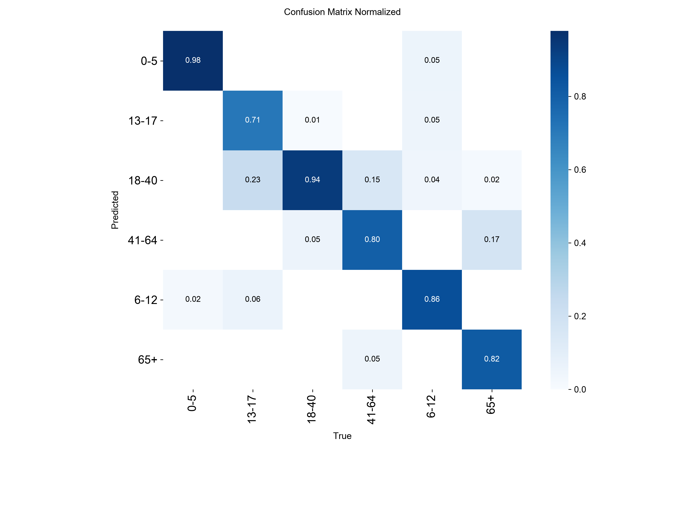
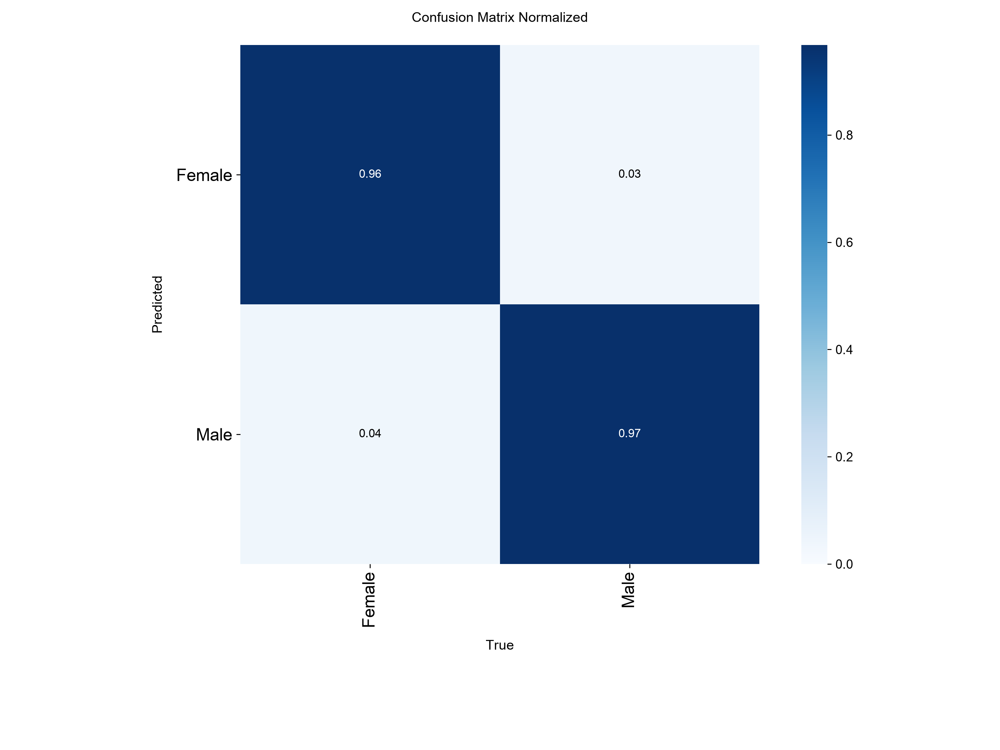
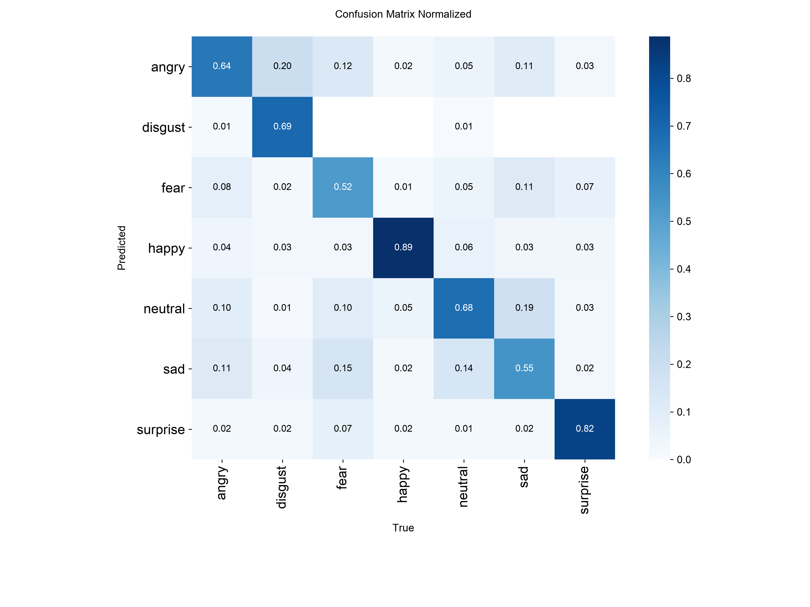

# Model Results

Every number here comes from a held-out test split, produced by the
evaluation scripts in `scripts/`, and is reproducible with the commands
in each section. Where a lab benchmark and live-camera behaviour
disagree, both are shown — the disagreement is usually the most useful
result on the page.

The pipeline runs four models: a face **detector** that finds faces, and
three **classifiers** (age, gender, emotion) that run on each detected
crop. A fifth model, age **regression**, supplies a continuous age for
display.

---

## Summary

| Model | Task | Test-set metric | Production weights |
|---|---|---|---|
| Face detector | Detection (WIDER FACE) | mAP@0.5 **74.63%** | `models/face_detection/final.pt` |
| Age classifier | 6-class (UTKFace) | top-1 **88.77%** | `models/age_gender/final_age.pt` |
| Gender classifier | 2-class (UTKFace) | top-1 **96.34%** | `models/age_gender/final_gender.pt` |
| Emotion classifier | 7-class (FER-2013) | top-1 **69.69%** | `models/emotion/final.pt` |
| Age regression | Continuous (UTKFace) | MAE **3.65 years** | `models/age_gender/regression_age.pt` |

All classifiers are `yolov8n-cls`, the detector is `yolov8n`, and the
regression model is a torchvision ResNet18 with a single-output head
(YOLOv8 has no regression task). Everything was trained from scratch on
public datasets rather than adapted from a pretrained face model.

---

## Face detector

Trained on WIDER FACE (32,203 images, 393,703 annotated faces), then
fine-tuned with augmentation shifted toward retail-camera framing —
wider zoom range, reduced mosaic, since mosaic shrinks every face to
roughly a quarter frame and compounds WIDER FACE's small-face bias in
the wrong direction for this use case.

```bash
PYTHONPATH=scripts ./venv/bin/python3 scripts/train_widerface_baseline.py
PYTHONPATH=scripts ./venv/bin/python3 scripts/evaluate_widerface_finetune.py
```

### Test-set metrics

| Metric | Baseline | Fine-tuned | Δ |
|---|---|---|---|
| mAP@0.5 | 76.23% | **74.63%** | −1.60 |
| mAP@0.5:0.95 | 41.75% | 40.42% | −1.33 |
| Precision | 86.35% | 84.87% | −1.48 |
| Recall | 67.54% | 66.43% | −1.11 |

Recall on WIDER FACE's official difficulty partition (the authors' own
Easy/Medium/Hard split, not a reconstruction):

| Difficulty | GT faces | Baseline | Fine-tuned |
|---|---|---|---|
| Easy | 3,538 | 94.18% | 93.70% |
| Medium | 6,527 | 89.87% | 89.14% |
| Hard | 15,766 | 71.10% | 68.79% |

**The fine-tune regressed on every benchmark metric and failed its Hard-recall
threshold.** It shipped anyway. That decision is the point of the next section.

### Why the worse model is in production

WIDER FACE is crowd scenes with hundreds of tiny faces per image. The
deployment is a handful of near-frontal faces at 1–4 m. A model tuned
toward the second gets worse at the first, and the benchmark measures
only the first.

Both checkpoints were recorded **once per condition** and replayed
through each, so they are compared on identical frames rather than two
separate live takes:

| Condition | Frames | Baseline | Fine-tuned | Haar cascade (prior implementation) |
|---|---|---|---|---|
| Close (1 m) | 379 | 100% | **100%** | 98.5% |
| Medium (2 m) | 37 | 100% | **100%** | 98.5% |
| Side view | 191 | 96.9% | **97.4%** | **27.0%** |
| Looking down | 123 | 100% | **100%** | 46.3% |
| Empty background | 96 | 1.0% false positive | **0.0%** | — |

The two conditions that motivated replacing the Haar cascade — faces
turned away from the camera — went from 27% and 46% detection to
97–100%. The fine-tuned checkpoint also produced **zero** false
detections on an empty background where the baseline produced one.

**The lesson kept in the codebase:** a benchmark measures the dataset it
was built from. When the benchmark and the deployment disagree, the
deployment wins, and the disagreement gets documented rather than
hidden.

---

## Age and gender classifiers

Two independent `yolov8n-cls` classifiers — YOLOv8 classification is
single-label per run, so age and gender train separately even though
both labels come from the same UTKFace images (33,481 images, stratified
70/15/15 split).

```bash
PYTHONPATH=scripts ./venv/bin/python3 scripts/finetune_age_gender.py
PYTHONPATH=scripts ./venv/bin/python3 scripts/evaluate_age_gender_finetune.py
```

### Age: the bin scheme mattered more than the tuning

Three schemes were trained end to end before one worked:

| Scheme | Age top-1 | Verdict |
|---|---|---|
| Uniform 4-bin | 84.87% | Passed, but bins too coarse to be useful |
| Uniform 10-bin | 69.36% | **Abandoned** — adult brackets collapsed |
| **Asymmetric 6-bin** | **88.77%** | Production |

The 10-bin attempt is the informative failure: narrowing adult ranges
made accuracy *worse*, because a face at 34 and a face at 41 are not
reliably separable from pixels alone at this resolution. The final
scheme keeps every bin that proved reliable at its original width
(`0-5`, `6-12`, `13-17`, `65+`) and merges the entire adult range that
plateaued regardless of tuning into `18-40` and `41-64`.

Per-class F1 on the production model:

| Class | Baseline F1 | Fine-tuned F1 |
|---|---|---|
| 0-5 | 0.969 | **0.971** |
| 6-12 | 0.837 | **0.866** |
| 13-17 | 0.749 | **0.779** |
| 18-40 | 0.920 | 0.919 |
| 41-64 | 0.785 | **0.790** |
| 65+ | 0.843 | **0.872** |



Errors are almost entirely between *adjacent* bins — the model rarely
confuses a child with an adult, it confuses 41-64 with 18-40. For
demographic aggregation that is the benign failure mode.

### Gender

| Metric | Baseline | Fine-tuned |
|---|---|---|
| top-1 | 95.86% | **96.34%** |
| Female F1 | 0.959 | 0.963 |
| Male F1 | 0.959 | 0.964 |



Balanced across both classes, with no bin-scheme sensitivity — gender is
a genuinely easier problem than age here.

### Live-camera behaviour

| Condition | Detection rate | Age accuracy | Gender accuracy |
|---|---|---|---|
| Normal light | 79.5% | 25.5% | 91.1% |
| Low light | 95.9% | 34.0% | **100%** |
| Turned away | 81.2% | 40.2% | 97.9% |
| Angled 45° | 52.4% | 30.0% | 95.8% |

**Gender holds up; age does not.** 88.77% on the test set becomes
25–40% live. UTKFace is curated, well-lit, mostly frontal portraits; a
ceiling-mounted camera at 3 m is none of those. Gender survives the
domain shift because its signal is coarse and robust; age depends on
fine texture — skin detail, wrinkles — that is the first thing lost to
resolution, motion blur, and off-axis viewing.

This is why age is treated as a **soft demographic hint** in the product
and never as a per-person fact.

---

## Emotion classifier

`yolov8n-cls` on FER-2013 (35,887 images, 7 classes).

```bash
PYTHONPATH=scripts ./venv/bin/python3 scripts/finetune_emotion.py
PYTHONPATH=scripts ./venv/bin/python3 scripts/evaluate_emotion_finetune.py
```

### Test-set metrics — top-1 69.69%

| Class | Precision | Recall | F1 | Support |
|---|---|---|---|---|
| happy | 0.886 | 0.888 | **0.887** | 1,774 |
| surprise | 0.804 | 0.823 | **0.813** | 831 |
| disgust | 0.755 | 0.694 | 0.723 | 111 |
| neutral | 0.609 | 0.676 | 0.640 | 1,233 |
| angry | 0.605 | 0.641 | 0.622 | 958 |
| sad | 0.583 | 0.548 | 0.565 | 1,247 |
| fear | 0.602 | 0.523 | 0.560 | 1,024 |



Read down a column (the true class) to see where its predictions went.
Happy and surprise sit almost alone on the diagonal — each has one
highly salient visual feature (a wide smile, an open mouth). The other
five blur into **each other**: true disgust is called angry 20% of the
time, true neutral is called sad 19%, and sad's errors spread roughly
evenly across neutral, angry and fear rather than concentrating on any
single confusable partner.

That structure — one tangled cluster, not five independently noisy
classes — is what motivated the change below.

### Live-camera behaviour, and the label change it forced

Mean accuracy across recorded webcam sessions:

| Class | Test-set recall | Live accuracy |
|---|---|---|
| neutral | 67.6% | **82.5%** |
| happy | 88.8% | **80.7%** |
| surprise | 82.3% | 60.4% |
| angry | 64.1% | 56.4% |
| sad | 54.8% | 34.2% |
| fear | 52.3% | **11.2%** |
| disgust | 69.4% | **3.7%** |

Disgust and fear score respectably on the benchmark and collapse almost
entirely on live video — the largest lab-to-real gap of any class by a
wide margin.

**Resolution:** the pipeline collapses angry, disgust, fear and sad into
a single `negative` label. This is a post-hoc remap of the same 7-class
model's output, not a retrain — confidence for `negative` is the summed
probability mass of the four merged classes, which is the correct answer
to "how sure is the model this is a negative emotion" regardless of
which one.

| Merged `negative` label | Value |
|---|---|
| Recall | ~81.3% |
| Precision | ~86.7% |
| F1 | ~0.84 |

That beats every one of the four classes individually, because most of
what was dragging each down was confusion *with the other three* — which
stops being an error once they share a label.

**The honest caveat**, found in the same reconstruction and kept
visible: roughly 20% of true *neutral* frames land in `negative` (mostly
via sad), against 5% leakage from happy and 10% from surprise. Since
neutral is the most common expression in real footage, `negative` counts
run somewhat inflated by genuinely neutral people. This is a product
decision made with the number in hand, not a bug discovered later.

### Alternative evaluated and rejected

DeepFace's pretrained emotion model was benchmarked on the identical
test split for a fair comparison: **56.37%** top-1, against this
project's 69.69%. It lost on every class. The from-scratch model stayed
in production.

---

## Age regression

The 6-bin classifier is coarse for live display ("18-40" is not very
informative), so a separate model predicts a continuous age. The
classifier still handles analytics; regression only feeds the display.

Ultralytics has no regression task, so this is a torchvision ResNet18
with a single-output head, trained with early stopping on validation
MAE.

```bash
PYTHONPATH=scripts ./venv/bin/python3 scripts/train_age_regression.py
PYTHONPATH=scripts ./venv/bin/python3 scripts/evaluate_age_regression.py
```

**Overall MAE: 3.65 years**

| Age group | MAE | Support |
|---|---|---|
| 0-17 | **1.33 y** | 1,225 |
| 18-30 | 2.94 y | 1,544 |
| 31-50 | 5.22 y | 1,222 |
| 51+ | 5.61 y | 1,033 |

(Buckets are for reporting only — the model never sees bins during
training.)

The error profile mirrors the classifier's: near-perfect on children,
degrading through adulthood. Both models are reading the same signal,
and that signal genuinely thins out with age. Regression sidesteps the
classifier's ceiling because there are no bin boundaries to be confused
across — a 41-year-old predicted as 44 is a 3-year error, not a
misclassification.

---

## Reproducing these numbers

Datasets are not committed (`data/` is gitignored). Prepare them first:

```bash
PYTHONPATH=scripts ./venv/bin/python3 scripts/prepare_utkface.py
PYTHONPATH=scripts ./venv/bin/python3 scripts/prepare_fer2013.py
PYTHONPATH=scripts ./venv/bin/python3 scripts/prepare_widerface.py
```

Each writes a `distribution_report.json` alongside the processed data,
recording the exact class balance the split produced.

Every evaluation script writes a JSON report next to the weights it
evaluated (`models/<task>/*_report.json`), which is what the tables above
are generated from. Re-running an evaluation overwrites its report, so
the committed reports always describe the committed weights.

## Known limitations

- **Age degrades badly on live camera input** (25–40% vs 88.77% on the
  test set). Treated as a soft hint, never a per-person fact.
- **Fear and disgust are not usable live** (3–11%), which is why the
  four negative emotions ship as one label.
- **`negative` is inflated by neutral** — roughly 20% of true neutral
  frames leak into it.
- **Face detection falls to ~52%** on faces angled past about 45°, which
  bounds every downstream classifier: an undetected face is not
  classified at all.
- **Training data imbalance is documented, not corrected.** UTKFace
  overrepresents White faces ~5.5×; FER-2013's disgust class is 1.5% of
  the data. Both are stated because they bound what the reported accuracy
  means, particularly across demographic groups.
