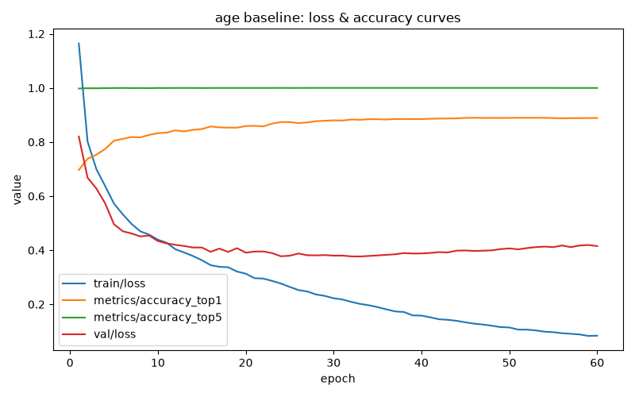
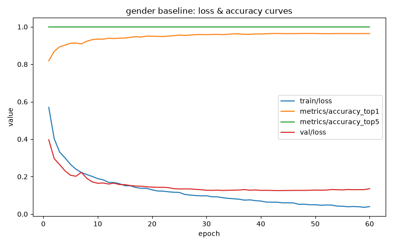

# Age & gender demographic model — overview

This indexes every report and decision behind RetailVision's demographic
model line — the component of the single pipeline (see root `CLAUDE.md`)
that predicts **age** and **gender** from a detected face crop. Two
outputs exist by design: a discrete **classifier** (analytics-facing,
coarse buckets, `yolov8n-cls`) and a continuous **regression** model
(display-facing, precise-where-possible estimate, plain PyTorch ResNet18).
Both are trained on UTKFace but are otherwise independent models.

Read top to bottom for the full story in order, or jump to a section.
Each links out to its full doc where one exists.

## Current state at a glance

| Component | Status | Key metric | Weights |
|---|---|---|---|
| Gender classifier | Production; validated on live video | 96.34% test acc · 91-100% live across 4 conditions | `final_gender.pt` |
| Age classifier (6-bin) | Production | 88.77% test acc · live accuracy not yet re-measured on this scheme | `final_age.pt` |
| Age regression | Experimental, display-only | 3.65y MAE test · informal live testing only | `regression_age.pt` |
| Live pipeline integration | Not started | — | `pipeline_demo.py` still only runs face detection |

## Timeline & decisions

### 1. Dataset preparation

33,481 UTKFace images (`UTKFace/` + `crop_part1/`, 7 malformed filenames
skipped), laid out as a `yolov8n-cls`-compatible folder tree
(`data/utkface/processed/{age,gender}/{train,val,test}/<class>/`), 70/15/15
stratified split, seed 42. Original age binning was uniform 4-bin
(`0-17`/`18-30`/`31-50`/`51+`) — later superseded (see the hybrid 6-bin
section below). Gender is ~50/50 balanced; race is documented but
unbalanced (White ~5.5x overrepresented) and tracked for fairness
auditing, not corrected.

→ Full doc: [`docs/datasets/utkface.md`](../datasets/utkface.md)

### 2. Baseline classifiers

Two independent `yolov8n-cls` models trained from scratch, Ultralytics
defaults (100 epochs, `imgsz=224`).

| Task | top1 accuracy | Notes |
|---|---|---|
| Gender | 95.78% | Strong, no overfitting — still improving at epoch 100 |
| Age (4-bin) | 84.43% | Extremes (`0-17` F1 0.96, `51+` F1 0.89) strong; middle brackets (`18-30`/`31-50`) weak (F1 0.72-0.82); mild overfitting after ~epoch 70-80 |

→ Full doc: [`docs/models/age_gender_baseline.md`](age_gender_baseline.md)

### 3. Fine-tuned classifiers

Retrained from `yolov8n-cls.pt` (not continued from baseline weights, to
avoid compounding overfitting) with augmentation + tuned hyperparameters
(60 epochs, batch 32, `optimizer="SGD"`, `lr0=0.005`, `patience=15`).

| Task | Threshold | Result | Status |
|---|---|---|---|
| Gender | 85% | 96.40% | PASS — genuine improvement, no overfitting |
| Age (4-bin) | 75% | 84.87% | PASS — but essentially flat vs. baseline; middle-bracket confusion unresolved, overfitting shifted *earlier* (epoch ~22) |

Decision: accepted as-is (the required bar is clearing 75%, not beating
the baseline). Documented that any further age work should target the
`18-30`/`31-50` boundary specifically rather than more hyperparameter
tuning — this is exactly what the rebinning investigation (next) attempted.

→ Full doc: [`docs/models/age_gender_finetune.md`](age_gender_finetune.md)

**Note on the graphics for the original baseline/fine-tune**: `scripts/train_age_gender_baseline.py`
and `finetune_age_gender.py` always write to the same fixed output paths
(`models/age_gender/baseline_age.pt`, `final_age.pt`, and their loss-curve
PNGs) regardless of which age-bin scheme is active. The later 6-bin
retrain silently overwrote the original 4-bin weights, JSON reports, and
PNG curves with 6-bin ones — confirmed by inspecting the current
`baseline_report.json`/`final_report.json` on disk, which hold 6-bin
class labels, not the 4-bin numbers quoted above. The 4-bin numbers
above are correct and sourced from the two docs linked, written at the
time those runs completed; the *graphics* for those specific runs no
longer exist on disk. The current PNGs at those paths are the 6-bin
scheme's curves — see section 6 below, where they're the correct artifact.

### 4. Real-world evaluation

The fine-tuned classifiers tested against live laptop-webcam video (not
just the static test set) across 4 conditions: `normal_light`,
`low_light`, `turned_away`, `angled_45`.

| Condition | Face detection rate | Age accuracy | Gender accuracy |
|---|---|---|---|
| Test set (static) | — | 84.87% | 96.40% |
| `normal_light` | 79.5% | 25.49% | 91.13% |
| `low_light` | 95.9% | 34.04% | 100% |
| `turned_away` | 81.3% | 40.17% | 97.86% |
| `angled_45` | 52.4% | 29.96% | 95.78% |

**Finding 1**: gender generalizes well to live video (91-100% across all
conditions) — production-viable as trained.

**Finding 2**: age classification collapses in *every* condition,
including the easiest one (`normal_light`, frontal/well-lit) — 25-40%
live vs. 84.9% on the static test set, with predictions confidently
biased toward the youngest bracket. Investigated and ruled out a
file-path-vs-array-input code bug (identical predictions either way);
most likely cause is domain shift between UTKFace's aligned studio crops
and the Haar cascade's loose live bounding boxes — not yet fixed.

**Finding 3**: face detection itself fails past ~45° yaw (52.4% detection
rate) — a known, expected Haar-cascade limitation, not a classifier issue.

→ Full doc: [`docs/model_evaluation.md`](../model_evaluation.md)

### 5. Age rebinning investigation (abandoned, not merged)

Prompted by wanting finer-grained age *display* than 4 wide buckets.
Tried uniform 7-class, then 10-class age binning, through the full
baseline → fine-tune pipeline.

| Metric | 10-bin baseline | 10-bin fine-tuned | Threshold |
|---|---|---|---|
| Age top1 | 68.35% | 69.36% | 75% — **FAIL** |
| Gender top1 | 96.45% | 96.81% | 85% — PASS |

Per-class F1 split cleanly in two: childhood/adolescence and elderly
classes stayed strong (F1 0.82-0.98, tracking real developmental
transitions), while every working-age adult bracket (`18-25` through
`61-70`) plateaued at F1 0.50-0.65 and was largely unresponsive to
fine-tuning — `26-32` and `33-40` didn't move at all (F1 unchanged to
three decimals after a full augmented fine-tune pass). Age top5 accuracy
stayed at 99.5% throughout, showing the model understood the fine
distinctions in principle but couldn't commit confidently — a genuine
data/task ceiling on narrow adult age bins from a single photo, not a
tuning problem.

**Decision**: abandon narrower classification bins for the fine-grained
display need; pursue a continuous regression model instead (see the
hybrid 6-bin section below). Keep the classifier for what it's actually
good at — broad, reliable buckets — informing the hybrid scheme adopted
next.

This investigation lives on a separate unmerged branch (its data/weights
were never merged into production); this section captures its findings
for the permanent record since the branch itself won't persist alongside
`main`.

### 6. Hybrid 6-bin scheme + regression model (current)

Two changes shipped together:

**a. Asymmetric 6-bin classifier scheme.** Keep every bin the rebinning
investigation proved reliable exactly as fine as it was (`0-5`, `6-12`,
`13-17`, `65+`), merge the entire adult range that plateaued regardless of
tuning into two wider buckets (`18-40`, `41-64`). Retrained baseline +
fine-tune from scratch against this scheme (~11.6h combined, overnight
run).

| Scheme | Age accuracy | Gender accuracy | Age threshold |
|---|---|---|---|
| Uniform 4-bin (original) | 84.87% | 96.40% | PASS |
| Uniform 10-bin (abandoned) | 69.36% | 96.81% | FAIL |
| **Asymmetric 6-bin (current)** | **88.77%** | **96.34%** | **PASS** |

Beats the original 4-bin classifier outright, not just avoiding the
10-bin collapse. Every class now lands at F1 ≥ 0.78 — no weak class
left; the merged `18-40` bucket (which absorbed the 10-bin scheme's
weakest classes) is now the *strongest* age class at F1 0.919.

Unlike every prior age run, validation accuracy kept climbing even after
validation loss bottomed out, rather than reversing — the coarser,
more-separable classes gave the model an easier optimization landscape.

→ Full doc: [`docs/models/age_gender_6bin_results.md`](age_gender_6bin_results.md)
→ Bin rationale: [`docs/datasets/utkface.md`](../datasets/utkface.md) ("Why these bins")

**b. Age regression model.** A separate plain-PyTorch ResNet18 regressor
for continuous age display, trained independently of the classifier
(Ultralytics has no regression task). Overall test MAE **3.65 years**;
error rises with age (1.33y for children, 5.6y for 51+) — the inverse
shape of the classifier's difficulty curve, since regression's failure
mode is error *magnitude* rather than *boundary confusion*.

→ Full doc: [`docs/models/age_regression_results.md`](age_regression_results.md)

### 7. Live testing on the current (6-bin + regression) models

`scripts/live_demo.py` runs both the 6-bin classifier and the regression
model together on webcam video, showing e.g. `18-40 (~26y, 0.91) /
Male (0.97)` per detected face — no ground truth, just a sanity check.

One informal ground-truth-logged session has been run so far
(`normal_light` condition only, reusing `evaluate_real_world.py`):

| | Value |
|---|---|
| Frames logged | 369 |
| Face detection rate | 98.1% |
| Age accuracy (6-bin) | 61.9% |
| Gender accuracy | 100% |

Encouraging relative to the earlier 25.49% `normal_light` age accuracy on
the old 4-bin model — consistent with the 6-bin scheme's classes being
easier to separate — but this is a **single uncontrolled session**, not
the full 4-condition methodology used earlier, so treat it as directional
only. See "Open items" below for what's still missing to make this a
proper comparison.

## Open items (not yet done)

- **Full real-world re-evaluation**: only `normal_light` has been
  re-tested against the 6-bin classifier; `low_light`, `turned_away`,
  `angled_45` still reflect the old 4-bin model from the earlier
  evaluation.
- **Mixed-scheme log file**: `runs/real_world_eval/normal_light.csv`
  contains both the old 4-bin rows (1,755) and the new 6-bin rows (369)
  in the same file, from reusing the `normal_light` condition name. Not
  yet split or cleaned up.
- **Regression model has no live-accuracy number**: `evaluate_real_world.py`
  only logs classifier predictions today, not the regression estimate —
  test-set MAE (3.65y) is the only measured accuracy so far.
- **Age classifier's live-camera domain-shift issue** (see Finding 2
  above) is not fixed, only diagnosed — the 6-bin retrain may or may not
  have helped; unknown until the other 3 conditions are re-run.
- **Not wired into the live pipeline** (`pipeline_demo.py`): all of the
  above are standalone scripts (`live_demo.py`, `evaluate_real_world.py`),
  not yet integrated into the actual capture → detect → classify loop the
  production pipeline will run.
- **Per-race breakdown** (flagged since the original baseline,
  `docs/datasets/utkface.md`): still not done for any age or gender model
  — race is unbalanced in the training data (White ~5.5x overrepresented)
  and aggregate accuracy can hide group-level gaps.

## Where everything lives

| Kind | Path |
|---|---|
| Dataset prep code | `scripts/utkface_prep/` |
| Classifier training/eval code | `scripts/age_gender_baseline/`, `scripts/age_gender_finetune/` |
| Regression training/eval code | `scripts/age_regression_prep/`, `scripts/age_regression/` |
| Real-world eval code | `scripts/real_world_eval/`, `scripts/evaluate_real_world.py`, `scripts/summarize_real_world_eval.py` |
| Live demo | `scripts/live_demo.py` |
| Classifier weights | `models/age_gender/{baseline,final}_{age,gender}.pt` (current = 6-bin) |
| Regression weights | `models/age_gender/regression_age.pt` |
| Classifier JSON reports | `models/age_gender/{baseline,final}_report.json`, `real_world_eval_report.json` |
| Regression JSON report | `models/age_gender/regression_report.json` |
| Loss/MAE curve PNGs | `models/age_gender/*_loss_curves.png`, `runs/age_regression/training_curves.png` |
| Raw per-epoch training logs | `runs/age_gender_{baseline,finetune}/{age,gender}/results.csv`, `runs/age_regression/results.csv` |
| Real-world per-frame logs | `runs/real_world_eval/*.csv` |
