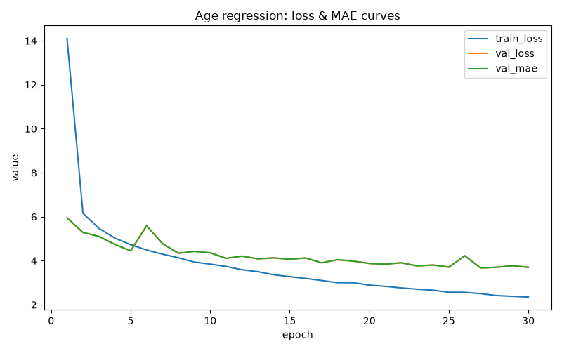

# Age regression model (RET-31)

## Setup

Plain PyTorch/torchvision **ResNet18** (ImageNet-pretrained) with the
classification head replaced by `nn.Linear(in_features, 1)`
(`scripts/age_regression/model.py`). Ultralytics/YOLOv8 has no native
regression task — confirmed via `from ultralytics.cfg import TASKS` →
`frozenset({'detect', 'classify', 'pose', 'segment', 'obb', 'semantic'})`
— so this model uses a standalone PyTorch training loop instead of
YOLOv8, unlike every other model in this project.

Trained on manifests from `scripts/prepare_age_regression.py` (23,436
train / 5,021 val / 5,024 test rows) — the same UTKFace source and
stratified split as the classifier, but written as continuous
`(path, age, gender)` CSVs rather than a folder-per-class layout, since
regression has no discrete classes to symlink into.

L1 loss (directly optimizes MAE, the eval metric, and is more robust to
mislabeled/outlier ages than MSE), Adam, `lr=1e-4`, `batch=32`,
`imgsz=224`, up to 30 epochs with early stopping on validation MAE
(`patience=5`). Same augmentation philosophy as the classifier (see
`docs/datasets/utkface.md`): horizontal flip, mild rotation, mild color
jitter — no vertical flip, no aggressive HSV shift.

## Why regression, not another classifier bin scheme

Directly motivated by the RV-008 rebinning investigation's finding (see
`README.md` in this folder → "RV-008"): narrower age *classification*
bins hit a hard ceiling on adult faces (F1 0.50-0.65, unresponsive to
tuning) because the classes genuinely overlap in visual feature space.
Regression sidesteps the bin-boundary problem entirely — there's nothing
to be confused across — and naturally gives more precise output where
the visual signal supports it (children, elderly) and appropriately loose
output where it doesn't (working-age adults), rather than a classifier
confidently committing to the wrong decade.

## Training

Ran the full 30-epoch budget. Best validation MAE **3.668 at epoch 27**,
only three non-improving epochs short of the `patience=5` early-stop
trigger — i.e. training stopped because it hit the epoch cap, not because
it had clearly converged. A follow-up with a larger budget (40-50 epochs)
may still squeeze out a small further gain; not urgent.

`val_loss` and `val_mae` overlap exactly in the plot — expected, not a
plotting bug: the loss function (L1) *is* MAE, so both series are the
same numbers by construction.

## Results (held-out test split, 5,024 images)

| Metric | Value |
|---|---|
| Overall MAE | **3.65 years** |

| Age bucket (RV-005 4-bin edges, for cross-run comparability) | MAE | Support |
|---|---|---|
| 0-17 | 1.33 | 1,225 |
| 18-30 | 2.94 | 1,544 |
| 31-50 | 5.22 | 1,222 |
| 51+ | 5.61 | 1,033 |

Error climbs steadily with age — roughly the inverse shape of the
classifier's per-class F1 (strongest at the extremes, weakest in the
middle). Not a contradiction: the classifier's difficulty is *boundary
confusion* between adjacent bins, which coarse buckets sidestep; the
regression model's difficulty is *magnitude of error in years*, driven by
how much visual variance exists within a given chronological age.
Childhood aging is fast and visually consistent (MAE 1.33); adult/elderly
aging is slow and highly variable between individuals, and `51+` is also
a much wider true-age range than the other buckets, so predictions for
the oldest faces likely get pulled toward the training distribution's
center. An overall MAE of 3.65 years is in line with published
age-estimation benchmarks (commonly 3-6 years MAE) for a comparable
model/data scale.

Note: bucketed here using the RV-005 4-bin edges purely for report
comparability (`REPORT_AGE_BUCKETS` in `scripts/age_regression/constants.py`)
— this is a reporting-only grouping. The model itself never saw any bins
during training, and this grouping is unrelated to the classifier's
current production 6-bin scheme.

## Live testing

Wired into `scripts/live_demo.py` alongside the classifiers — every
detected face shows both the classifier's bin and the regression model's
continuous estimate together, e.g. `18-40 (~26y, 0.91) / Male (0.97)`,
matching the intended production split: classifier output for analytics,
regression output for display. **Not yet run through the RV-006-style
ground-truth-logged real-world evaluation** — `evaluate_real_world.py`
only logs classifier predictions today, not the regression estimate, so
there is no live-accuracy number for this model yet, only test-set MAE
above and informal webcam testing.

## Artifacts

- Weights: `models/age_gender/regression_age.pt`
- Full metrics: `models/age_gender/regression_report.json`
- Training curve: `runs/age_regression/training_curves.png`
- Raw per-epoch log: `runs/age_regression/results.csv`
- Training/eval code: `scripts/age_regression/`, `scripts/age_regression_prep/`
- CLI: `scripts/prepare_age_regression.py`, `scripts/train_age_regression.py`,
  `scripts/evaluate_age_regression.py`