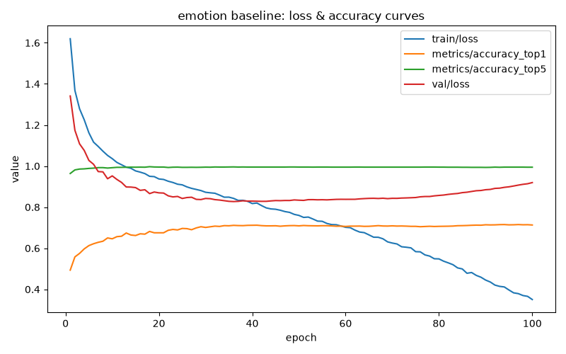

# Emotion classifier baseline (RV-007)

## Setup

A single `yolov8n-cls` model trained from scratch on FER-2013
(`data/fer2013/processed/`), using Ultralytics default hyperparameters —
100 epochs, `imgsz=224` (the classification-resolution default; 640 is a
detection-mode default and doesn't apply here), seed 42, on Apple Silicon
MPS. See `scripts/emotion_baseline/constants.py` for the exact values and
`docs/datasets/fer2013.md` for class distribution and prep rationale.

Total wall time: ~3.5h (12,553s, 100 epochs).

YOLOv8 classification mode reports top1/top5 accuracy rather than mAP@0.5
(a detection-mode metric); per-class precision/recall/F1 are computed
separately via scikit-learn on the held-out test split (7,178 images),
per `scripts/emotion_baseline/evaluate.py`. Full numbers in
`models/emotion/baseline_report.json`.

## Results

| Metric | Value |
|---|---|
| top1 accuracy | 71.12% |
| top5 accuracy | 99.22% |

| Class | Precision | Recall | F1 | Support |
|---|---|---|---|---|
| happy | 0.880 | 0.894 | 0.887 | 1,774 |
| surprise | 0.803 | 0.844 | 0.823 | 831 |
| disgust | 0.818 | 0.649 | 0.724 | 111 |
| neutral | 0.637 | 0.693 | 0.664 | 1,233 |
| angry | 0.614 | 0.649 | 0.631 | 958 |
| sad | 0.605 | 0.589 | 0.597 | 1,247 |
| fear | 0.633 | 0.523 | 0.573 | 1,024 |

(ordered by F1, descending)

## Findings — partial confirmation of the expected weak spots

The ticket flagged Fear and Disgust as expected underperformers given
FER-2013's known noise. **Fear is indeed the weakest class** (F1 0.573,
lowest recall at 0.523) — confirmed as expected.

**Disgust is a more interesting case.** Despite being badly
underrepresented (392 of ~25,837 train images, ~1.5% of the data — by far
the smallest class), it lands mid-pack at F1 0.724, ahead of neutral,
angry, and sad. Its precision is high (0.818 — when the model predicts
disgust, it's usually right) but recall is middling (0.649 — it misses a
real chunk of actual disgust examples). This is the signature of a class
that's visually distinctive *when the model commits to it*, but so rare
in training that the model is conservative about predicting it at all —
different from Fear's problem, which is closer to genuine visual
ambiguity with other classes rather than under-prediction.

**Happy and surprise are comfortably the strongest classes** (F1 0.887,
0.823) — the most common class and one of the more visually distinct
expressions, respectively.

**Angry, sad, and neutral cluster together** in the 0.60-0.66 F1 range —
three "medium energy," visually-overlapping expressions. This tracks a
documented FER-2013 characteristic: a resting, tired, or mildly-annoyed
face can plausibly be labeled any of these three depending on the
original annotator's judgment call, not a model weakness specific to this
run.

## Training health — mild overfitting after ~epoch 40, accuracy holds anyway

Train loss falls monotonically the whole run (1.62 → 0.35). Val loss
bottoms around epoch 38-40 (~0.83) then climbs steadily to 0.92 by epoch
100 — a mild overfitting signature, similar timing to the age
classifier's original 4-bin baseline (RV-004). However, validation top1
accuracy doesn't reverse alongside it: it plateaus around 70-71% from
epoch ~40 onward and holds there for the rest of the run rather than
declining. This suggests the model's *confidence calibration* degrades
past epoch 40 (rising val loss) without its actual *decisions* getting
worse (flat accuracy) — a candidate for earlier stopping (`patience`
~15-20) in a fine-tuning pass, matching the RV-005 playbook for the age
classifier.

## Artifacts

- Weights: `models/emotion/baseline.pt`
- Full metrics: `models/emotion/baseline_report.json`
- Loss/accuracy curve: `models/emotion/baseline_loss_curves.png`
- Raw per-epoch log: `runs/emotion_baseline/emotion/results.csv`

Not yet integrated into the live pipeline (`pipeline_demo.py`) — this is
a standalone classifier. Next: RV-008 (RET-9) fine-tuning with
augmentation and tuned hyperparameters, same pattern as RV-005.