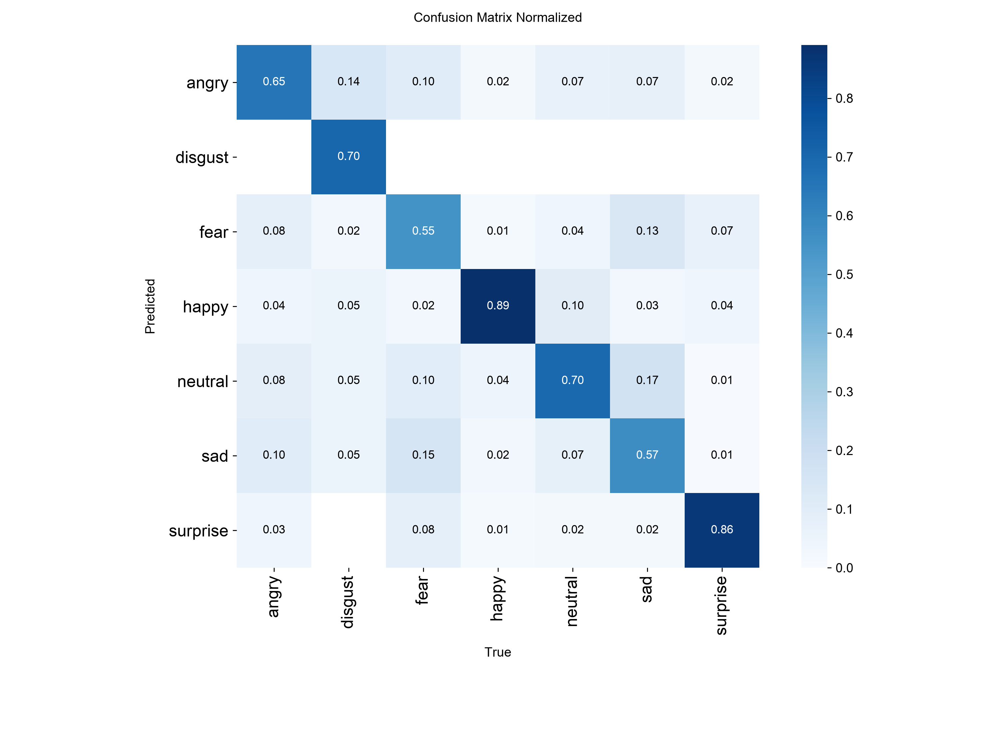
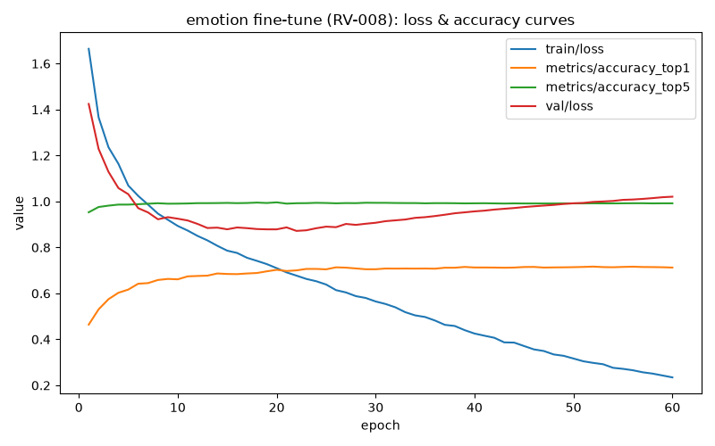

# Emotion classifier fine-tune

## Setup — iteration 1

Retrained from the original `yolov8n-cls.pt` checkpoint (not continued
from the baseline weights), same rationale as the age/gender fine-tune:
avoid compounding the mild overfitting already present in `baseline.pt`
past ~epoch 40. Hyperparameters reused the age/gender fine-tune's recipe
as a reasonable first attempt for a similarly-sized single `yolov8n-cls`
task — 60 epochs, batch 32, `optimizer="SGD"`, `lr0=0.005`, `patience=15`
— plus augmentation adapted from `docs/datasets/utkface.md`'s philosophy,
with one FER-2013-specific change: `hsv_h`/`hsv_s` (hue, saturation) were
dropped entirely since FER-2013 is grayscale — a zero-saturation pixel has
no hue to shift, so those two would be pure no-ops. `hsv_v` (brightness)
was kept since it still affects grayscale pixel intensity.

```python
AUGMENTATION = {
    "fliplr": 0.5, "flipud": 0.0, "degrees": 10.0,
    "translate": 0.1, "scale": 0.2, "hsv_v": 0.2, "erasing": 0.2,
}
```

Ran the full 60 epochs; `patience=15` was not triggered (best epoch was
52, only 8 epochs short of the cap).

## Threshold check

Unlike the age/gender models (aggregate top1 threshold), the required bar
here is **per-class recall** on the two classes considered commercially
relevant for retail:

| Class | Recall | Threshold | Result |
|---|---|---|---|
| Happy | 88.78% | 80% | **PASS** |
| Neutral | 67.56% | 80% | **FAIL** |

Fear and Disgust are explicitly not held to a threshold — both are
pre-flagged as expected known limitations.

## Full results — iteration 1

| Metric | Value |
|---|---|
| top1 accuracy | 69.69% (baseline: 71.12%) |
| top5 accuracy | 98.87% (baseline: 99.22%) |

| Class | Precision | Recall | F1 | Baseline F1 |
|---|---|---|---|---|
| happy | 0.886 | 0.888 | 0.887 | 0.887 |
| surprise | 0.804 | 0.823 | 0.813 | 0.823 |
| disgust | 0.755 | 0.694 | 0.723 | 0.724 |
| neutral | 0.609 | 0.676 | 0.640 | 0.664 |
| angry | 0.605 | 0.641 | 0.622 | 0.631 |
| fear | 0.602 | 0.523 | 0.560 | 0.573 |
| sad | 0.583 | 0.548 | 0.565 | 0.597 |

Fine-tuning made things **slightly worse across almost every class**, not
better — top1 fell 1.43 points, and every class except surprise (flat)
lost F1 versus the baseline. This is a materially different (and worse)
outcome than the age/gender fine-tune, which was merely flat on its weak
classes rather than actively regressing.

## Why Neutral failed — confirmed via confusion matrix, not guessed



True Neutral is predicted correctly 70% of the time, but **17% of true
Neutral examples are predicted as Sad** — by far its single largest
confusion, well ahead of the next leaks (fear 10%, happy 10%, angry 7%).
This is a genuine visual-overlap problem between two "medium energy"
expressions, the same category of issue flagged in
`docs/models/emotion_baseline.md`'s findings section and structurally
similar to the age classifier's original 18-30/31-50 confusion.

## Training health — overfitting set in earlier and more sharply than baseline



Val loss climbs almost the entire run: it dips only briefly to ~0.87 by
epoch 22, then rises steadily to 1.02 by epoch 60, while train loss keeps
falling (1.67 → 0.23) — a much more pronounced and earlier-onset
overfitting signature than the baseline showed (which didn't turn until
~epoch 38-40). Unlike the 6-bin age classifier's pattern, where validation
accuracy kept climbing despite rising val loss, here **both** val loss
rose **and** top1 plateaued/dipped from its epoch-52 peak — a less benign
signature than anything seen in this project so far.

## Hypothesis: augmentation intensity, not learning rate/schedule

The augmentation recipe was carried over from the age/gender fine-tune
(UTKFace) without adjusting for FER-2013's very different source
resolution. UTKFace source photos are full-resolution studio crops;
FER-2013 images are natively **48×48**, upscaled ~4.7x to the model's 224
input size — so any augmentation that occludes or distorts a fixed
*fraction* of the image removes proportionally far more of the (already
limited) signal.

Two specific suspects:

- **`erasing=0.2`** randomly blanks out a region of the face on ~20% of
  training samples. At 48×48 native detail, that region is
  disproportionately large relative to the tiny features — mouth corner
  tension, eyebrow angle — that are exactly what separates "neutral" from
  "sad." This is the primary suspect.
- **`degrees=10` rotation + `translate=0.1`** compound the same effect:
  already-low-detail images losing more of their limited usable signal
  than the equivalent augmentation would remove from a higher-resolution
  UTKFace photo.

This is a plausible, evidence-motivated hypothesis (the confusion
matrix + the fact that *every* class got worse, not just Neutral, points
at something systemically over-aggressive rather than a Neutral-specific
issue) — but it is not confirmed. Iteration 2 is the test.

## Iteration 2: reduced augmentation — hypothesis rejected

A second iteration was run before falling back to an alternative model,
reducing exactly the augmentation terms suspected above and changing
nothing else:

| Parameter | Iteration 1 | Iteration 2 |
|---|---|---|
| `erasing` | 0.2 | **0.0** |
| `degrees` | 10.0 | **5.0** |
| `translate` | 0.1 | **0.05** |
| `scale`, `fliplr`, `hsv_v` | unchanged | unchanged |
| `epochs`, `batch`, `lr0`, `patience` | unchanged | unchanged |

| Class | Iter 1 recall | Iter 2 recall |
|---|---|---|
| Happy | 88.78% | 88.44% |
| Neutral | 67.56% | 67.32% |
| Overall top1 | 69.69% | 69.52% |

**The hypothesis was wrong.** Every number moved by less than a point, and
Neutral got very slightly *worse*, not better. The confusion matrix
confirms it directly: true Neutral → predicted Sad actually rose from 17%
to 19%. Reducing augmentation intensity did not touch the underlying
problem at all — this is strong evidence the Neutral/Sad overlap is a
genuine structural property of FER-2013 at 48×48 resolution, not an
artifact of over-aggressive augmentation. Full iteration-2 artifacts
preserved at `models/emotion/final_iter2.pt` /
`final_report_iter2.json` / `runs/emotion_finetune/emotion_iter2/`.

## DeepFace fallback: evaluated and rejected

After two fine-tuning iterations both failed the Neutral threshold,
DeepFace's pre-trained emotion model (`facial_expression_model`, itself
trained on FER-2013 — same 7-class taxonomy, so a direct comparison) was
evaluated as an alternative, on the identical held-out FER-2013 test
split, via `scripts/evaluate_emotion_deepface.py`
(`enforce_detection=False`, `detector_backend="skip"`, since these images
are already tightly-cropped single-face chips).

| Class | Our model (iter 1) recall | DeepFace recall |
|---|---|---|
| Happy | **88.78%** | 76.83% (fails 80% too) |
| Neutral | **67.56%** | 55.88% |
| Surprise | 82.31% | 71.48% |
| Disgust | 69.37% | 44.14% |
| Angry | 64.09% | 42.90% |
| Fear | 52.34% | 41.80% |
| Sad | 54.77% | 41.06% |
| **Overall top1** | **69.69%** | **56.37%** |

DeepFace's pre-trained model is worse across **every single class**, by a
wide margin — not just failing to beat our custom classifier on Neutral,
but failing the Happy threshold too (76.83%, which our own model clears
easily). Full report: `models/emotion/deepface_report.json`.

## Final decision

**Reject the DeepFace alternative and keep our own fine-tuned classifier
(iteration 1) as the production emotion model.** Switching to DeepFace
would be a strict regression on every class, including the one class
(Happy) that already passes. `models/emotion/final.pt` has been restored
to iteration 1's weights (the marginally better of the two iterations on
both threshold metrics).

**Neutral is accepted as a documented known limitation**, alongside Fear
and Disgust (already pre-flagged as expected weak classes). This is now
backed by three independent pieces of evidence rather than one tuning
attempt:

1. Two fine-tuning iterations with substantially different augmentation
   intensity produced nearly identical Neutral recall (67.56%, 67.32%).
2. The confusion matrix shows a consistent, specific failure mode (true
   Neutral → predicted Sad, 17-19%) rather than diffuse/random error.
3. An independently-trained, widely-used pre-trained model on the same
   dataset does *worse* on this exact class (55.88%), ruling out
   "our training pipeline specifically is the problem."

Together these point to a genuine ceiling in FER-2013 at 48×48 resolution
for separating "neutral" from "sad," not a fixable modeling choice —
structurally the same kind of finding as the age classifier's rebinning
investigation (`docs/models/age_rebinning_investigation.md`): some
classification boundaries aren't reliably recoverable from the available
visual signal, regardless of how much tuning is thrown at them.

## Artifacts

**Production (iteration 1, restored as final):**
- Weights: `models/emotion/final.pt`
- Full metrics: `models/emotion/final_report.json`
- Loss/accuracy curve: `models/emotion/final_loss_curves.png`

**Iteration 1 (preserved copies, same content as production above):**
- `models/emotion/final_iter1.pt`, `final_report_iter1.json`, `final_loss_curves_iter1.png`
- Confusion matrix: `runs/emotion_finetune/emotion_iter1/confusion_matrix_normalized.png`
- Raw per-epoch log: `runs/emotion_finetune/emotion_iter1/results.csv`

**Iteration 2 (rejected, preserved for the record):**
- `models/emotion/final_iter2.pt`, `final_report_iter2.json`, `final_loss_curves_iter2.png`
- Confusion matrix: `runs/emotion_finetune/emotion_iter2/confusion_matrix_normalized.png`
- Raw per-epoch log: `runs/emotion_finetune/emotion_iter2/results.csv`

**DeepFace comparison (rejected):**
- Report: `models/emotion/deepface_report.json`
- Evaluation tooling: `scripts/evaluate_emotion_deepface.py`

Not yet integrated into the live pipeline (`pipeline_demo.py`) — this
remains a standalone classifier.
