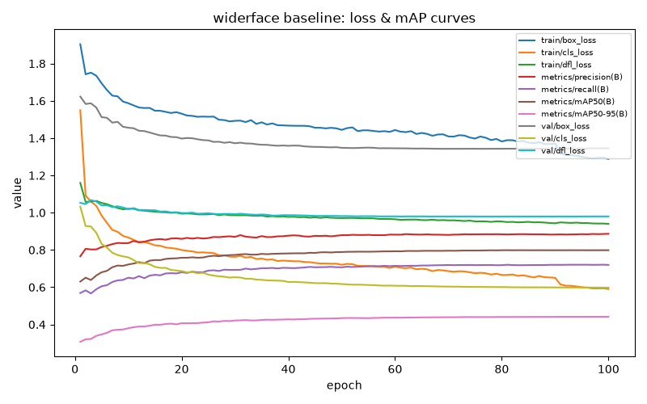

# Face-detector baseline (WIDER FACE)

## Setup

A single `yolov8n` **detection**-mode model trained from scratch on WIDER
FACE (`data/widerface/processed/`, see `docs/datasets/widerface.md` for
dataset prep, filtering, and the known crowd-scene-vs-retail domain gap),
using Ultralytics default hyperparameters — 100 epochs, `imgsz=640` (the
actual detection-mode default; unlike the age/gender/emotion
*classification* baselines, which override down to `imgsz=224`, this one
keeps the framework default since it's the correct resolution for this
task, not a deviation from it), seed 42. See
`scripts/widerface_baseline/constants.py` for the exact values.

Two throughput/stability adjustments, neither affecting what's learned:
`cache="disk"` (WIDER FACE's source images are far larger than anything
else trained in this project, so caching decoded/resized images avoids
re-decoding from scratch every epoch), and `batch=8`, down from
Ultralytics' detection-mode default of 16 (WIDER FACE's crowd-scene
images can carry up to ~2,000 ground-truth boxes in a single frame,
which spikes label-assignment memory well past typical detection
datasets — a first attempt at batch=16 hit an out-of-memory condition
during training and crashed). See `scripts/widerface_baseline/train.py`
for the full rationale on both.

This is the project's first **detection**-mode YOLOv8 training run — the
age/gender and emotion models are all `yolov8n-cls` (classification
mode: one label per already-cropped face image). Detection mode predicts
bounding boxes directly on full scenes, so the training loss, output
head, and evaluation metrics all differ from the classification
baselines (mAP instead of top1/top5 accuracy).

### Evaluation methodology

Two separate evaluations are run, both against our own held-out test
split (1,613 of WIDER FACE's official 3,226-image val set — the official
test set has no public ground truth, see `docs/datasets/widerface.md`):

1. **Overall metrics** (mAP@0.5, mAP@0.5:0.95, precision, recall) via
   Ultralytics' own detection validator (`model.val()`).
2. **Official Easy/Medium/Hard recall** — WIDER FACE's real,
   author-defined difficulty partition, not an approximation. This
   required downloading the dataset's separate `eval_tools` package
   (`http://shuoyang1213.me/WIDERFACE/support/eval_script/eval_tools.zip`)
   for its ground-truth `.mat` files
   (`data/widerface/raw/wider_face_split/ground_truth/wider_{easy,medium,hard}_val.mat`),
   since the difficulty partition itself was computed by the original
   authors via a proposal-recall procedure and can't be reconstructed
   from the raw box annotations alone. Recall (not the full
   confidence-ranked AP curve WIDER FACE's official protocol computes) is
   measured via greedy IoU≥0.5 matching between each image's official
   keep-boxes and the model's predictions, restricted to the ~1,613
   official-val images that fall in our test split. See
   `scripts/widerface_baseline/official_eval.py` for the full
   implementation and rationale — notably, an earlier plan to substitute
   an ad-hoc face-count bucket (`0`, `1`, `2-5`, ..., `101+`, built for
   RV-025's val/test split stratification) in place of the real
   Easy/Medium/Hard partition was reconsidered before writing evaluation
   code, in favor of the real official ground truth.

## Results

*TBD — fill in after `scripts/train_widerface_baseline.py` and
`scripts/evaluate_widerface_baseline.py` complete.*

| Metric | Value |
|---|---|
| mAP@0.5 (test split) | — |
| mAP@0.5:0.95 (test split) | — |
| Precision (test split) | — |
| Recall (test split) | — |

| Difficulty | Recall | GT faces evaluated | Images evaluated |
|---|---|---|---|
| Easy | — | — | — |
| Medium | — | — | — |
| Hard | — | — | — |

## Findings

*TBD — expected shape, to confirm once real numbers land: Hard should be
meaningfully lower than Easy (this is the standard, well-documented WIDER
FACE pattern — Hard includes far more small/blurred/occluded faces, see
`docs/datasets/widerface.md`'s box-size percentiles). If Hard and Easy
come out close together, or Hard is *higher* than Easy, that's a red flag
worth investigating rather than reporting as-is — same lesson as the
emotion model's close-range/happy anomaly (`docs/model_evaluation.md`):
an unexpected number is a prompt to check the methodology before trusting
the result.*

## Training health

*TBD — loss/mAP curves, once training completes.*

## Artifacts

- Weights: `models/face_detection/baseline.pt`
- Full metrics: `models/face_detection/baseline_report.json`
- Loss/mAP curve: `models/face_detection/baseline_loss_curves.png`
- Raw per-epoch log: `runs/widerface_baseline/widerface/results.csv`

Not yet integrated into the live pipeline (`InferencePipeline` still uses
Haar cascade) — this is a standalone detector at this stage. Next:
fine-tuning with augmentation tuned for retail camera conditions (RV-027),
then real-world evaluation (RV-028) before the production swap (RV-029).