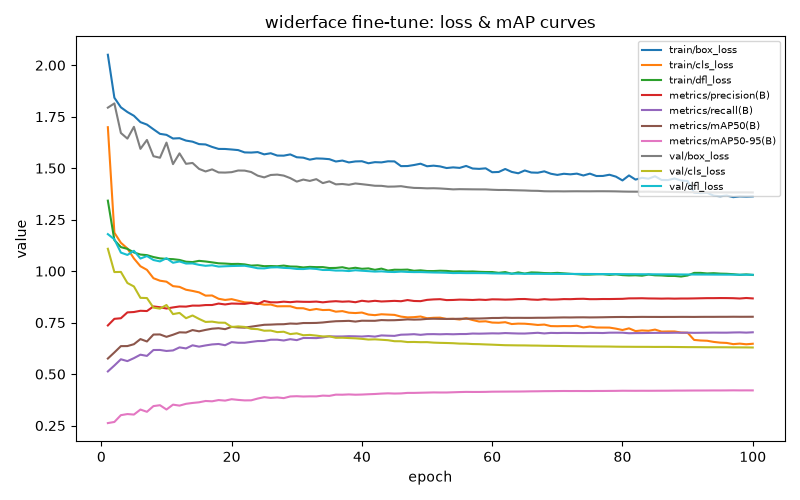

# Face-detector fine-tune (WIDER FACE)

## Setup

Retrained from `models/yolov8n.pt` (not continued from
`models/face_detection/baseline.pt`), same from-scratch-retrain rationale
used for every other fine-tune in this project: a clean run with a lower
learning rate and tuned augmentation, instead of compounding whatever the
baseline already converged to.

Adjusted from the baseline: `lr0=0.005` (down from 0.01), `patience=15`
(early stopping — the baseline showed no overfitting even at epoch 100,
so this isn't fighting instability the way the classification
fine-tunes' shorter epoch budgets were, it's just a safety net),
`optimizer="SGD"`. `batch=8` and `cache="disk"` carry over unchanged from
the baseline — the memory-spike risk from WIDER FACE's dense crowd
images (docs/datasets/widerface.md) doesn't go away just because
augmentation changed. See `scripts/widerface_finetune/constants.py` for
exact values.

Augmentation is tuned specifically for the retail-camera domain gap —
see `docs/datasets/widerface.md`'s "Augmentation strategy" section for
the full rationale behind each change (`scale=0.9`, `mosaic=0.5`,
`degrees=10.0`).

## Results

*TBD — fill in after `scripts/finetune_widerface.py` and
`scripts/evaluate_widerface_finetune.py` complete.*

| Metric | Baseline | Fine-tuned | Δ |
|---|---|---|---|
| mAP@0.5 (test split) | 76.23% | — | — |
| mAP@0.5:0.95 (test split) | 41.75% | — | — |
| Precision (test split) | 86.35% | — | — |
| Recall (test split) | 67.54% | — | — |

| Difficulty | Baseline recall | Fine-tuned recall | Δ |
|---|---|---|---|
| Easy | 94.18% | — | — |
| Medium | 89.87% | — | — |
| Hard | 71.10% | — | — |

**Minimum acceptable Hard recall threshold: 71.10%** (the baseline's own
result — see `constants.py`'s `MIN_HARD_RECALL` for why this, not the
Haar cascade's real-world condition rates, is the right floor for this
ticket specifically).

## Findings

*TBD.*

## Training health

*TBD.*

## Artifacts

- Weights: `models/face_detection/final.pt`
- Full metrics: `models/face_detection/final_report.json`
- Loss/mAP curve: `models/face_detection/final_loss_curves.png`
- Raw per-epoch log: `runs/widerface_finetune/widerface/results.csv`

Not yet integrated into the live pipeline (`InferencePipeline` still uses
Haar cascade). Next: real-world evaluation against live-camera footage
(RV-028) — the actual gate for the production swap (RV-029), not this
dataset's own metrics.
